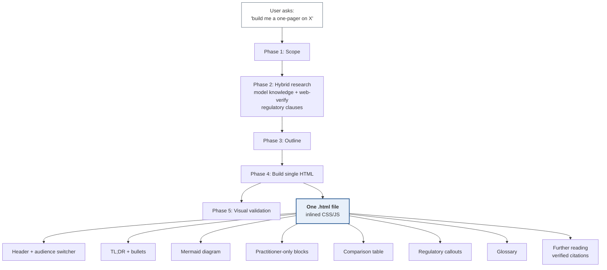

# build-educational-site

[](LICENSE)
[](SKILL.md)
[](https://www.anthropic.com)
[](#how-it-scores)
[](#how-it-scores)
[](#what-it-produces)

**TL;DR** — A Claude Code skill that turns a topic name into a single self-contained HTML explainer page: TL;DR, exec/practitioner audience switcher, Mermaid diagrams, comparison tables, regulatory callouts, glossary, and verified primary-source citations. Built for technical/regulatory topics that need to be readable by execs and engineers in the same artifact.

## What it produces



One file, no build step, no external dependencies except Mermaid via CDN. Opens in any browser. Looks professional enough to share with a regulator, an executive sponsor, or a new joiner — same artifact, different reader.

A runtime audience switcher in the header toggles visibility of practitioner-depth blocks, so the same file serves exec and engineering readers without forcing anyone to scroll past content that isn't for them.

## How it scores

Measured across three evals (FAPI 2.0, PCI-DSS 4.0 scope reduction, SPIFFE/SPIRE workload identity), with 12–13 structural and content assertions per eval. Baseline = same agent, same prompt, **no skill loaded**.

| Eval | With skill | Baseline (no skill) | Delta |
|---|---|---|---|
| FAPI 2.0 | 12/12 | 9/12 | +3 |
| PCI-DSS 4.0 scope reduction | 12/12 | 9/12 | +3 |
| SPIFFE/SPIRE workload identity | 13/13 | 9/13 | +4 |
| **Total** | **37/37 (100%)** | **27/37 (73%)** | **+27pp** |

Time and token cost vs baseline:

| Metric | With skill | Baseline | Delta |
|---|---|---|---|
| Time per page | 274s ± 22s | 248s ± 50s | +10% |
| Tokens per page | 50.5k ± 2.6k | 34.1k ± 5.3k | +48% |

The 48% token premium pays for the web-verification step — verified clause numbers, working-group governance, current spec versions. Worth it for regulated content; could be gated for purely conceptual topics.

**Where the skill consistently beats baseline** (failures unique to the no-skill runs):

- Audience switcher — baseline never produces one
- Further Reading / References section with primary-source links — baseline skipped all three
- Mermaid diagrams — baseline often uses inline SVG instead
- SPIFFE-ID-labeled identity provenance on diagrams
- Side-by-side comparison tables instead of split prose sections

**What the baseline still gets right** (largely thanks to a strong global CLAUDE.md):

- TL;DR at the top
- No emoji in technical output
- Section structure and visual quality

## Usage

Trigger phrases (any of these will activate the skill):

- "build me a one-pager on `<topic>`"
- "I need a primer / explainer / teaching page on `<topic>`"
- "create a self-contained webpage explaining `<topic>` for `<audience>`"
- "I'm presenting to my team Thursday on `<topic>`, build me an HTML page"

Output is saved to the current working directory using kebab-case naming (e.g., `fapi-2.0-explained.html`, `pci-dss-4.0-scope-reduction.html`).

## Install

The skill is a single `SKILL.md` file. Two installation options:

**As a `.skill` package**:

```bash
# Stage a clean copy (avoids bundling .git/), package, and install
mkdir -p /tmp/build-educational-site
cp SKILL.md /tmp/build-educational-site/
python -m scripts.package_skill /tmp/build-educational-site ~/.claude/skills/
```

**As a plain directory** (recommended for editing):

```bash
mkdir -p ~/.claude/skills/build-educational-site
cp SKILL.md ~/.claude/skills/build-educational-site/
```

Either path makes the skill available the next time Claude Code loads skills.

## Page template

The skill enforces a consistent section order across every page it builds:

| # | Section | Audience | Notes |
|---|---|---|---|
| 1 | Header + audience switcher | All | Title, subtitle, exec/practitioner toggle |
| 2 | TL;DR | All | Bold lead sentence + 3–5 bullet takeaways |
| 3 | Conceptual overview | All | Plain-language framing, "why does this exist" |
| 4 | Architecture / flow diagram | All | Mermaid; trust boundaries labeled with regulatory regime |
| 5 | Mechanics / deep-dive | Practitioner-only blocks | Wire-level detail, code/config snippets |
| 6 | Comparison or trade-off table | All | Side-by-side `<table>`, ≤8 rows |
| 7 | Regulatory callouts | All | One per applicable regime, cited |
| 8 | Glossary | All | Acronyms + multi-word terms of art |
| 9 | Further reading | All | Primary sources only, each annotated |

## Design system

JPMC-ready professional aesthetic. Conservative palette, generous whitespace, strong typographic hierarchy. **No emoji anywhere in the rendered output.**

```
--ink:         #0B1F33    /* primary text — deep navy */
--ink-muted:   #4A5A6B    /* secondary text */
--paper:       #FAFBFC    /* page background */
--accent:      #1B4F8C    /* links, primary brand — corporate blue */
--accent-soft: #E8F0FA    /* tinted callout background */
--warn:        #8B4513    /* regulatory callout accent — saddle brown */
```

Body type: `system-ui, -apple-system, "Segoe UI", Roboto` at 16px / 1.65. Content column capped at 860px.

## Visual validation

The repo includes `screenshot.mjs` for capturing desktop + mobile shots of any generated page using Playwright. Run on a supported architecture (x86_64 Linux, macOS, Windows; arm64 Ubuntu 26.04 is currently unsupported by Playwright):

```bash
npm install --save-dev playwright
npx playwright install chromium
node screenshot.mjs path/to/output.html docs/hero
```

Produces `docs/hero.desktop.png` (1440×900 @ 2x) and `docs/hero.mobile.png` (390×844 @ 2x).

## Repository structure

```
build-educational-site/
├── SKILL.md         — the skill itself (frontmatter + workflow + template)
├── evals/
│   └── evals.json   — 3 test cases with 37 assertions
├── screenshot.mjs   — Playwright visual-validation script
├── LICENSE          — MIT
└── README.md
```

## Caveats

- The skill's `description` field has been tuned manually for triggering breadth. The automated description-optimization loop (`run_loop.py`) needs to run from a regular terminal, not from inside a Claude Code session — `claude -p` subprocess auth fails when nested.
- Visual validation via Playwright requires a supported architecture. The skill notes this and skips rather than failing if the binaries aren't available.

## License

[MIT](LICENSE). Use it, fork it, modify it — just keep the attribution.
